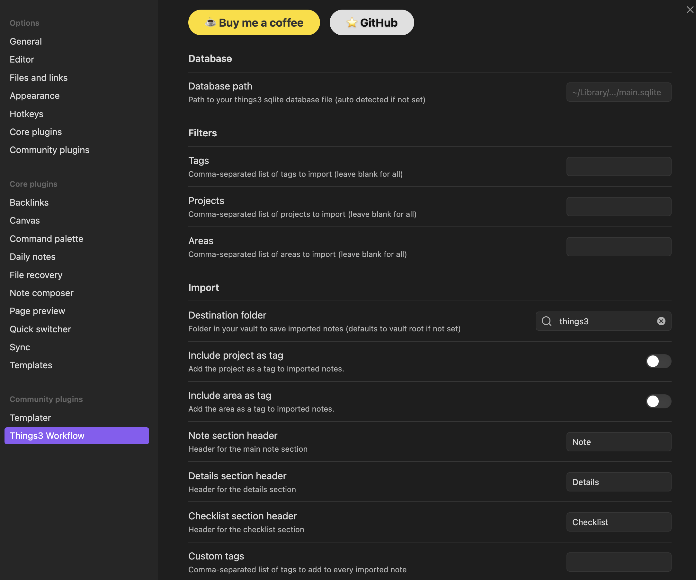

# Configuration

All configuration is managed via the plugin's settings tab in Obsidian. Each option is described below.

## Database Path
Set the path to your Things 3 SQLite database. On macOS, this is usually auto-detected. You can override it if needed.

## Filters

By default, all tasks are imported. You can set filters to limit which tasks are imported:

- **Tags**: Comma-separated list to filter imported tasks by tag.
- **Projects**: Filter by project name(s).
- **Areas**: Filter by area name(s).

## Import Options
- **Custom Tags**: Add custom tags to imported notes (deduplicated).
- **Include Project/Area as Tags**: Optionally add project and area as tags.
- **Custom Note Headers**: Change section headers (default: Note, Detail, Checklist).
- **Destination Folder**: Choose where imported notes are saved in your vault.  Default is the `$vault/things3`.

See [Usage](usage.md) for more details.

## Installation

You can install the Things3 Workflow plugin directly from within Obsidian using the Community Plugins feature:

1. Open Obsidian.
2. Go to **Settings** (the gear icon in the lower left).
3. Click on **Community plugins** in the sidebar.
4. Click **Browse** and search for `Things3 Workflow`.
5. Click **Install** next to the plugin.
6. After installation, click **Enable** to activate the plugin.

## Configuration Settings

  <iframe width="560" height="315" src="https://www.youtube.com/embed/xILB4gPuxZY?si=RWVHS2tGf_YUuSJN" title="YouTube video player" frameborder="0" allow="accelerometer; autoplay; clipboard-write; encrypted-media; gyroscope; picture-in-picture; web-share" referrerpolicy="strict-origin-when-cross-origin" allowfullscreen></iframe>

| Setting Name                | Description                                                      | Possible Values / Format                |
|-----------------------------|------------------------------------------------------------------|-----------------------------------------|
| Things3 Database Path       | Path to Things3 SQLite database                                  | File path (auto-detected on macOS)      |
| Tag Filters                 | Filter tasks by tags                                             | Comma-separated list (e.g. tag1,tag2)   |
| Project Filters             | Filter tasks by projects                                         | Comma-separated list (e.g. proj1,proj2) |
| Area Filters                | Filter tasks by areas                                            | Comma-separated list (e.g. area1,area2) |
| Custom Tags                 | Add custom tags to imported notes                                | Comma-separated list                    |
| Note Headers                | Customize section headers (Note, Detail, Checklist)              | Text                                    |
| Add Project/Area as Tags    | Add project and area as tags on import                           | Boolean (true/false)                    |
| Overwrite Handling          | Overwrite notes if deleted but cache is missing                  | Boolean (true/false)                    |

**How Tag, Project, and Area Filters Work Together**

- You can specify one or more values for each filter (comma-separated).
- A task must match _all_ specified filters to be imported (logical AND).
- For example, if you set Tag Filters to `work,urgent`, Project Filters to `Website`, and Area Filters to `Marketing`, only tasks that have at least one of the specified tags **and** belong to the `Website` project **and** are in the `Marketing` area will be imported.

**Example:**
| Task Name      | Tags         | Project   | Area      |
|---------------|--------------|-----------|-----------|
| Update site   | work,urgent  | Website   | Marketing |
| Write blog    | writing      | Blog      | Marketing |
| Fix bug       | work         | Website   | Dev       |

With filters:
- Tag Filters: `work,urgent`
- Project Filters: `Website`
- Area Filters: `Marketing`

Only "Update site" will be imported, because it matches all three filters.
